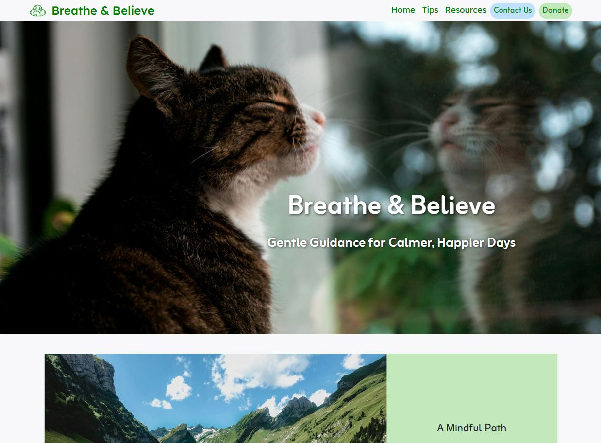
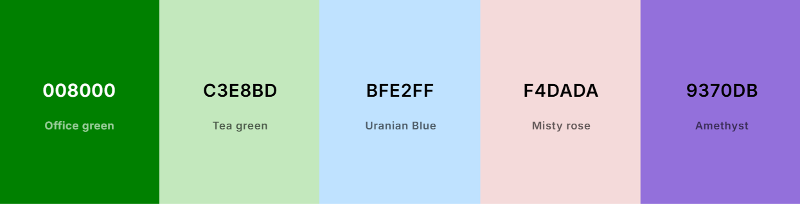
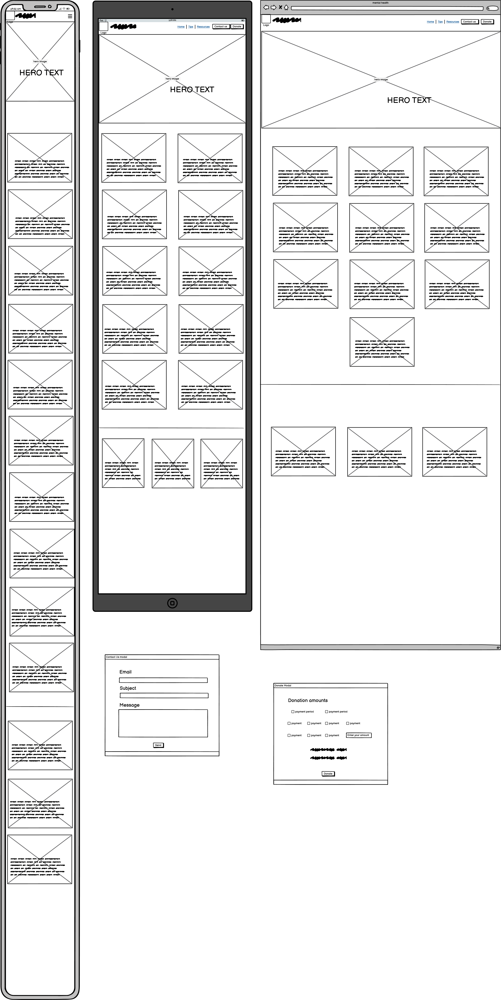

# Breathe & Believe

# Introduction
This is a project to demonstrate my learnings. Built with HTML, CSS, and Bootstrap components, this site seeks to provide helpful mental health tips and resources in an easy-to-navigate format. Keeping things simple with an accessible, and visually appealing single-page website.
There is currently no backend functionality.

## [Link to Live Website](https://wen-l-liu.github.io/mental_health_project/)

## Table of Contents
- [Project Outline](#project-outline)
    - [Key Objectives](#key-objectives)
- [UX Design](#ux-design)
    - [User Stories](#user-stories)
    - [Colours](#Colours)
    - [Wire Frames](#Wire-frames)
- [Features](#features)
- [Deployment / Dependencies](#deployment--dependencies)
- [Accounts](#accounts)
- [AI Implementation](#ai-implementation)
- [Testing and Validation](#testing-and-validation)
    - [HTML Validation](#HTML-Validation)
    - [CSS Validation](#CSS-Validation)
- [Technology](#technology)
- [References](#references)
- [External Resource Links](#external-resource-links)
- [Credits](#credits)

---

## Project Outline
This project aims to create an accessible, visually engaging single-page website focused on mental health awareness and support. The site offers practical tips, curated resources, and motivational content to help users manage stress and improve well-being. Designed for ease of use, it leverages responsive design principles and modern web technologies to ensure a seamless experience across devices.

### Key Objectives
- Create a clean, easy-to-navigate website with a calming color palette and inviting images to encourage users to stay and explore.
- Ensure the site is fully responsive and accessible across all devices.
- Present beginner-friendly mental health information, including how to recognize common issues and manage stress, in a supportive and organized layout.
- Offer uplifting quotes and inspiration on the homepage to motivate and reassure users.
- Provide clear links to trusted external resources for users seeking more in-depth information or support.
- Use HTML, CSS, and Bootstrap to deliver a welcoming, well-organized, and supportive user experience.

## UX Design

### User Stories
[Github project](https://github.com/users/wen-l-liu/projects/6) for planning with user stories

- As a site visitor, I want to see a positive, encouraging message about mental health as soon as I arrive, so that I feel welcomed and supported.
- As a site visitor, I want to find beginner-friendly mental health tips and information organized in a clear way, so that I can easily understand and access helpful advice.
- As a site visitor, I want to see uplifting quotes or affirmations, so that I feel encouraged and supported during my visit.
- As a site visitor, I want to quickly find and access trusted mental health resources, so that I can get further help if needed.
- As a site visitor, I want the website to have a consistent, calming design, so that I feel comfortable and supported while browsing.
- As a site visitor, I want to easily find a way to make a donation, so that I can support the mission of Breathe & Believe and help provide accessible mental health resources to others.

### Colours

I wanted soft colours to convey calmness.
As the project is a single page, I wanted more colours to help create seperation between each section.
I chose the main pastel versions of the primary colours, green, red, and blue.
The darker pine green is used for Logo colour and navbar links.
The purple hightlight is only used as a hover link colour change.
I kept white and black as they are just such versitle colours. Black just stands out from the pastel backgrounds.

### Wireframes

Click to expand CSS Validation Screenshot

The wireframes illustrate the planned layout for the website, showing a clean, single-page design with clearly separated sections for tips, resources, and motivational content. Included the 2 pop up modals for contact us and donation form. They show intuitive navigation, responsive elements, and a calming visual hierarchy to ensure accessibility and ease of use across devices.

## Features

- **Welcoming Hero Section:** A prominent, positive message and calming imagery greets users on arrival.
- **Beginner-Friendly Tips:** Clear, accessible mental health information and practical advice for managing stress.
- **Uplifting Quotes:** Affirmations and motivational quotes to encourage and support users.
- **Curated Resource Links:** Easy access to trusted external mental health resources for further help.
- **Donation Link:** A visible call-to-action for users who wish to support the mission.
- **Responsive Design:** Fully functional and visually appealing on all devices, from mobile to desktop.
- **Accessible Layout:** Uses semantic HTML and accessible color contrasts for inclusivity.
- **Modern UI Components:** Utilizes Bootstrap for consistent styling, navigation, and layout.
- **No Login Required:** All content is freely accessible without registration.
- **Lightweight & Fast:** Loads quickly with minimal dependencies, optimized images, and no backend.

## Deployment / Dependencies
### Deployment
The site is deployed using [GitHub Pages](https://pages.github.com/), which hosts the static files directly from the repository. No backend server or database is required

To deploy updates:
1. Commit and push changes to the `main` branch
2. GitHub Pages automatically rebuilds and serves the latest version

### Dependencies
- [Bootstrap 5](https://getbootstrap.com/) (via CDN) for responsive layout and components
- [Google Fonts](https://fonts.google.com/) (via CDN) for custom typography
- [Font Awesome](https://font-awesome.com) (via CDN) for scalable vector icons
- No build tools or package managers are required; all dependencies are loaded via CDN in the HTML

## Accounts
- You need to sign up for a GitHub account to deploy website using GitHub Pages and to manage your project repository. Creating an account allows you to push code, track changes, and collaborate with others on GitHub. You may also need a Pro account if tou wish to have unlimited use of Github Copilot or any AI features.
- To use Font Awesome icons, you need to set up a free Font Awesome Kit and include the provided script in your HTML. Visit [Font Awesome Kits](https://fontawesome.com/kits) to create and manage your kit.

## AI Implementation

- GitHub Copilot provided intelligent code suggestions for HTML, CSS, and Bootstrap.
    - Helped speed up building responsive layouts and accessible UI elements.
    - Streamlined repetitive tasks and improved code quality.
    - Ensured best practices were followed throughout development.
- Assisted in troubleshooting validation issues, such as heading structure and CSS syntax.
- Answered questions I had about the code, benefiting my learning and understanding.
- Used Microsoft Copilot to generate Ai images
    - Only ended up including one Ai image for meditation card, it's still not quite perfect for faces and people.
- Both Copilots help to generate ideas for the website.
    - Microsoft copilot for researching content to include external resources.
    - Github Copilot generating text for cards, topics and subject matters.
- Made the overall development process smoother and more efficient.
    - It's a real time saver.

## Technology
### Built with:
- **HTML5**: To structure content for the webpage.
- **CSS3**: For styling and layout, ensuring the site is visually appealing and accessible.
- **Bootstrap 5**: Provides a responsive grid system and prebuilt components for faster, consistent UI development.
- **Font Awesome**: Supplies scalable vector icons to enhance visuals.
- **Google Fonts**: Enables use of custom, web-friendly typography for improved readability and design.
- **Git**: To manage version control and track changes efficiently throughout development process.
- **GitHub**: For hosting the repository and managing the project.
- **GitHub Copilot**: For coding assistance throughout the project.

## Testing and Validation
### HTML Validation
#### Tools Used:
- [W3C Markup Validation Service](https://validator.w3.org/)
- Github Copilot
Copilot was first used to validate code and it found multiple inconsitent heading levels. I re-adjust heading usage to make sure only one h1 existed on the page, and the rest of the headings followed in correct order. I used Bootstrap Class "fs-1" top ensure text sizing remained the same as before change.

Click to expand HTML Validation Screenshot

Afterwards, index.html file was validated using the W3C Markup Validation Service to ensure there are no syntax errors and that the code adheres to web standards.

### CSS Validation
#### Tools Used:
- [W3C CSS Validation Service](https://jigsaw.w3.org/css-validator/)
- Github Copilot
Copilot was first used to validate code and it found space between the number and unit for "font-size: 1.25 rem;", I removed the space and fixed the issue.

Click to expand CSS Validation Screenshot

My style.css file was validated using the W3C CSS Validation Service to ensure there are no syntax errors and that the code adheres to CSS standards.

## References
- [Mental Health Foundation](https://www.mentalhealth.org.uk/) – UK based charity promoting good mental health
- [Mind UK](https://www.mind.org.uk/) – Mental health charity providing advice and support
- [NHS Mental Health](https://www.nhs.uk/mental-health/) UK National Health Service, medical advice
- [Youngminds](https://www.youngminds.org.uk/) Mental health charity for children, young people and their parents
- [Samaritans](https://www.samaritans.org/) a charity that offers free, confidential listening service to people in distress
- [Headspace](https://www.headspace.com/) a mindfulness and meditation app 

- [Bootstrap Documentation](https://getbootstrap.com/docs/5.3/getting-started/introduction/) – Official Bootstrap documentation
- [Font Awesome Documentation](https://docs.fontawesome.com/) – Official Font Awesome documentation
- [Google Fonts](https://fonts.google.com/) – Web fonts used in the project

## External Resource Links
- [squoosh.app](https://squoosh.app/) - A tool for compressing and resizing images, squashing file size
- [unsplash](https://unsplash.com/) - A source for free high-resolution images
- [pexels](https://www.pexels.com/) - A source for free high-resolution images

## Credits